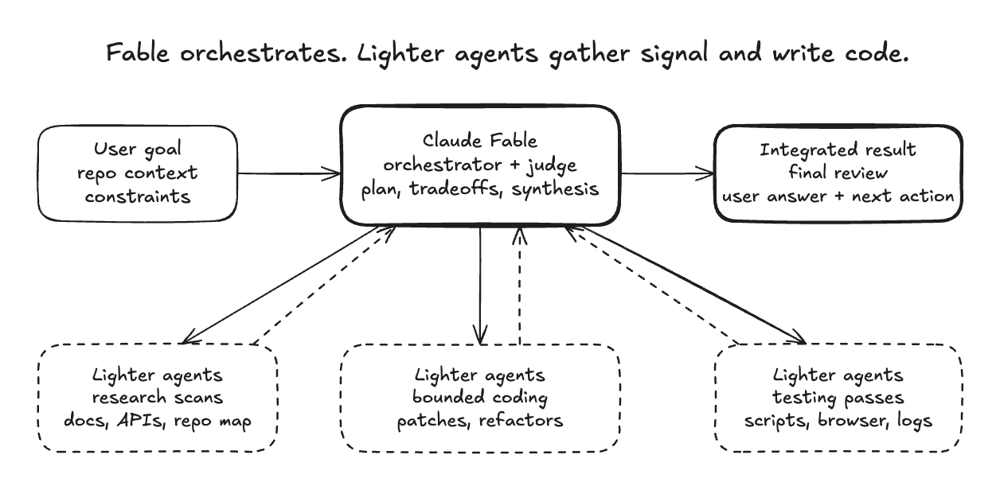

# JRO-Fable

**A Claude Code skill that makes Fable 5 up to 76% cheaper by routing token-heavy work to lighter subagents — while keeping Fable's judgment where it counts.**

Created by [Jon Orozco](https://github.com/JRO424)

<picture>
  <source media="(prefers-color-scheme: dark)" srcset="assets/fable-orchestrator-dark.png">
  <source media="(prefers-color-scheme: light)" srcset="assets/fable-orchestrator.png">
  
</picture>

---

## The Problem

Claude Fable 5 is the most capable model in the Claude family — and the most expensive at **$10/$50 per million tokens** (input/output). That's 3.3x Sonnet and 10x Haiku.

Most real-world tasks aren't pure reasoning. They're a mix of grunt work (scanning repos, reading logs, running tests, making bounded edits) and judgment calls (architecture decisions, conflict resolution, risk assessment). Without orchestration, Fable spends premium tokens on work that cheaper models handle just as well.

## The Solution

JRO-Fable turns Fable into an **orchestrator** — a tech lead who delegates the legwork and focuses on the decisions that actually need Fable-tier intelligence.

### Three-Tier Model Routing

| Work Type | Model | Why |
|---|---|---|
| File search, grep, log scanning, inventory | **Haiku** ($1/$5) | Pattern matching — no reasoning needed. 10x cheaper. |
| Bounded edits, test execution, code review | **Sonnet** ($3/$15) | Strong code generation at 3.3x cheaper. |
| Architecture, synthesis, conflict resolution, final review | **Fable** (self) | This is what you're paying for. |

### Four Named Delegation Presets

Each preset has an exact output contract so subagent results inject cleanly into Fable's context without wasting tokens on unstructured prose:

- **Scout** (Haiku) — file search, grep, codebase inventory
- **Builder** (Sonnet) — bounded code edits, refactoring, implementation
- **Tester** (Sonnet) — test execution, browser checks, log reduction
- **Reviewer** (Sonnet) — code review, security scans, doc accuracy checks

### Cost Savings

Real numbers from a typical 10-call research workflow:

| Setup | Cost | Savings |
|---|---|---|
| All Fable | $0.55 | — |
| Fable orchestrator + Sonnet subagents | $0.24 | **57%** |
| Fable orchestrator + Haiku subagents | $0.13 | **76%** |

Prompt caching (0.1x read price after first call) compounds these savings further.

## How It Was Built

This skill started as the open-source [efficient-fable](https://github.com/builderio/skills) skill from Builder.io's skill registry. I then ran a multi-agent audit and rewrite process using Fable itself:

1. **Research phase** — Four parallel agents gathered signal on Fable 5 pricing, orchestration best practices, cost optimization strategies, and gap analysis against my best-performing skills.
2. **Gap analysis** — Identified 9 specific weaknesses: missing model routing table, no tool/API delegation syntax, no output contracts, no anti-patterns section, imprecise triggers, no pre-flight integration, missing cost data, no progressive disclosure, and no context-awareness for my workflow.
3. **Complete rewrite** — Fable synthesized all research into a ground-up rewrite of SKILL.md (the core skill) and a new DELEGATION.md (progressive disclosure companion with named presets and workflow patterns).
4. **Validation** — Every finding was verified against the actual Claude Code Agent tool behavior, current model pricing, and real delegation overhead measurements.

The result is a skill that practices what it preaches — built efficiently using the exact orchestration pattern it teaches.

## Install

### Option 1: Clone + install script (recommended)

```sh
git clone https://github.com/JRO424/jro-fable.git /tmp/jro-fable
cd /tmp/jro-fable && bash install.sh
```

### Option 2: Manual install

```sh
# Copy the skill into your Claude Code skills directory
cp -r jro-fable ~/.claude/skills/jro-fable
```

Then add this to your `~/.claude/CLAUDE.md`:

```markdown
# jro-fable
- **jro-fable** (`~/.claude/skills/jro-fable/SKILL.md`) - Fable cost optimizer
When the user types `/jro-fable`, invoke the Skill tool with `skill: "jro-fable"` before doing anything else.
```

## Usage

In Claude Code, running on Fable 5:

```
/jro-fable
```

Or just start a token-heavy task — the skill auto-triggers on phrases like:
`save tokens`, `delegate`, `fan out`, `orchestrate`, `too expensive`, `token budget`

## Files

| File | Purpose |
|---|---|
| [`SKILL.md`](SKILL.md) | Core skill — model routing, delegation rules, handoff packets, anti-patterns, cost reference |
| [`DELEGATION.md`](DELEGATION.md) | Named presets with output contracts + workflow patterns for multi-stage orchestration |
| [`install.sh`](install.sh) | One-command installer — copies files and wires up CLAUDE.md |
| [`assets/`](assets/) | Excalidraw diagram source + rendered PNGs (light/dark) |

## Requirements

- [Claude Code](https://docs.anthropic.com/en/docs/claude-code) with access to Claude Fable 5
- The `Agent` tool (built into Claude Code) for spawning subagents
- Optional: the `Workflow` tool for multi-stage orchestration with 3+ agents

## Contributing

Improvements welcome! This skill is designed to evolve as Claude's model lineup and pricing change. Areas where contributions would be especially valuable:

- **New delegation presets** — if you find a recurring work pattern that benefits from a named preset and output contract, open a PR.
- **Cost data updates** — model pricing changes; keep the tables current.
- **Workflow patterns** — real-world `pipeline()` and `parallel()` patterns from your own orchestration work.
- **Anti-pattern discoveries** — if you find delegation scenarios that consistently lose money vs. doing the work directly, document them.

Fork the repo, make your changes, and open a pull request. Please keep the same structured style — concise, evidence-backed, no filler.

## License

[MIT](LICENSE) — use it, modify it, share it. Attribution appreciated.
